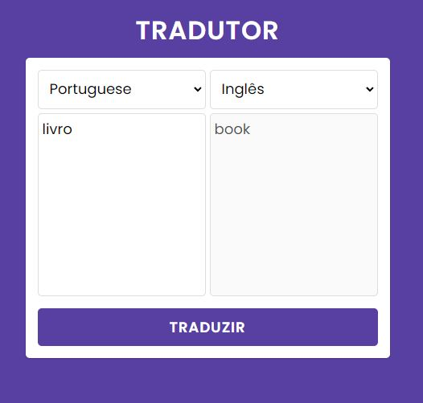
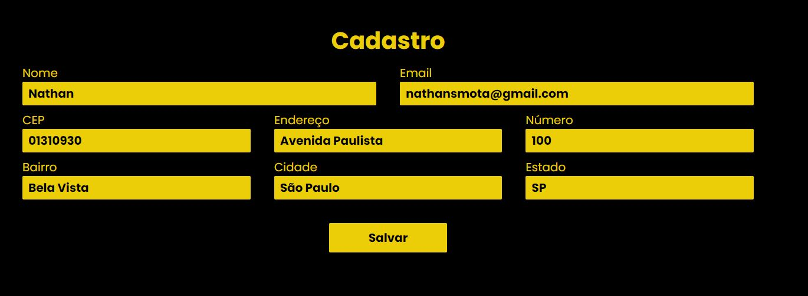
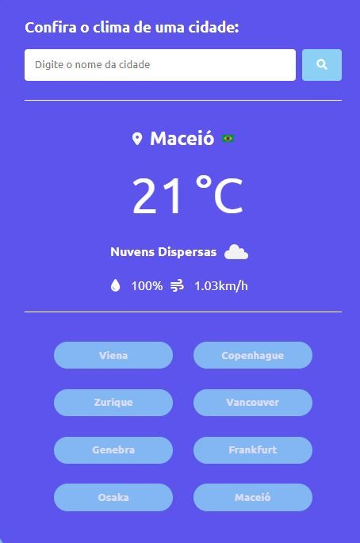

# Projetos JavaScript com Diferentes APIs

Bem-vindo ao repositório que abriga uma coleção de projetos desenvolvidos em JavaScript, cada um utilizando uma API diferente. O objetivo deste repositório é testar minhas habilidades em JavaScript consumindo APIs. 

## Projetos

### 1. Tradutor

O projeto de tradutor utiliza a API de tradução (MyMemory API) para realizar traduções de textos. Seu objetivo é a tradução de textos de um idioma para outro e uma interface simples para entrada de texto e exibição de resultados.

### 2. CEP API

Esse projeto busca consumir uma API de CEP (ViaCEP) em uma tela de cadastro, onde o usuário só irá digitar seu CEP e a API já irá completar todo Endereço (Endereço, Bairro, Cidade e Estado).

### 3. Clima

Aplicação de Clima com OpenWeather API para recuperar o Clima, Temperatura, Tempo, Umidade e Velociade do Vento.
Foi também utilizado a FlagsApi para recuperar as Bandeiras de cada país.

